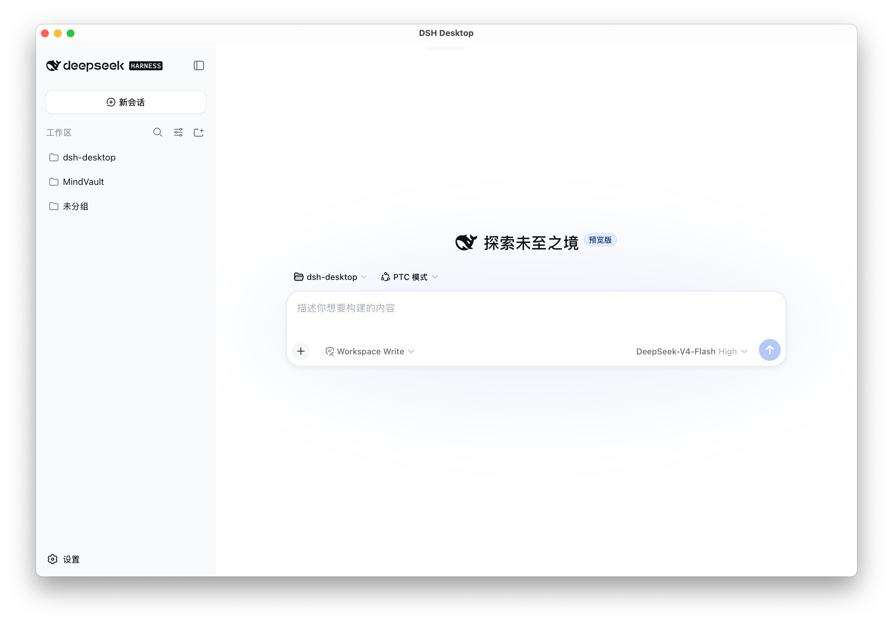
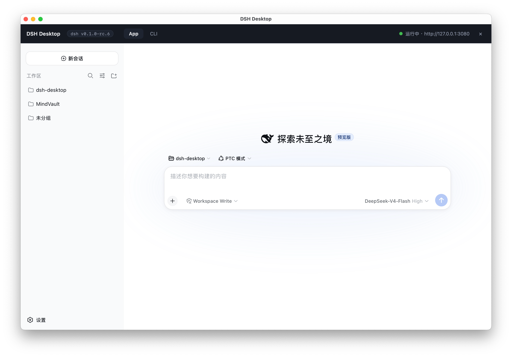
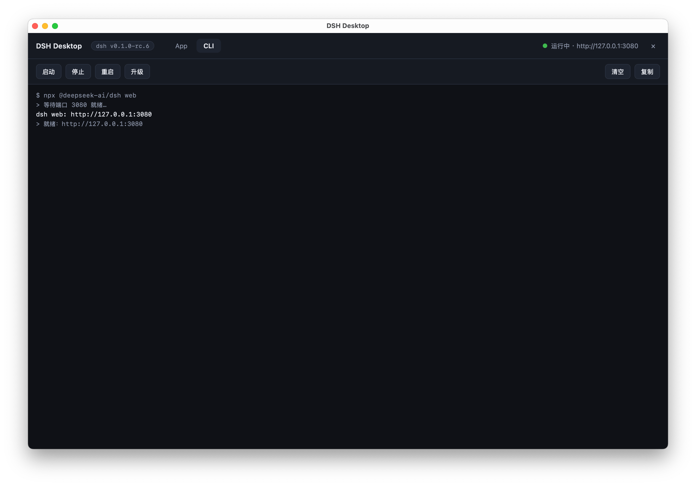

# DSH Desktop

[English](README.md) | [中文](README.zh-CN.md)

一个原生桌面应用（Tauri 2），将 [DeepSeek Harness](https://github.com/deepseek-ai/dsh) 的命令行工具和 Web UI 统一在一个窗口中管理。

## 截图

<p align="center">
  
  
  
</p>

## 目的

DeepSeek Harness 同时提供命令行界面和 Web UI，但分开管理不太方便。**DSH Desktop** 解决了这个问题：

- **统一管理**：在一个原生应用窗口中同时运行 CLI 和 Web UI
- **零定制逻辑**：完全调用原版 \`@deepseek-ai/dsh\` —— 没有重新实现，功能与原版完全一致
- **一键安装与升级**：首次启动自动全局安装 \`dsh\`，升级按钮通过 \`npm update -g\` 更新

可以把它理解为一个原生外壳，包装 \`dsh web\`，并提供进程管理、实时日志和简洁的 UI。

## 功能特性

- **自动启动服务**：启动应用时自动运行 \`dsh web\`（默认 http://127.0.0.1:3080）
- **环境检查**：启动时校验 Node.js 22.19.0+，版本缺失或过低时给出清晰提示（附「打开 Node.js 官网」按钮）
- **一键安装 dsh**：首次启动时若未安装，自动通过 npm 全局安装 \`@deepseek-ai/dsh\`
- **沉浸式 Web UI**：Web 界面铺满整个窗口；顶部小抓手悬停/点击可唤出悬浮工具栏（App/CLI 页签、状态指示灯、版本徽章），移开自动隐藏
- **内置交互式 CLI 终端**：「CLI」页签是一个真正的终端（xterm + PTY），可以直接输入命令、运行 `dsh`/`npm`，按 Ctrl+C 中断。shell 跟随你的登录 shell（`$SHELL`；macOS 默认 zsh），别名和 PATH 配置直接生效
- **插件管理**：「插件」页签通过 `dsh plugin --profile web add/remove <package>` 安装/卸载 profile 插件，命令在 CLI 终端中执行，实时显示进度且支持 Ctrl+C
- **进程管理**：启动 / 停止 / 重启 / 升级 / 清空 / 复制
  - **升级**：运行 \`npm update -g @deepseek-ai/dsh\` 更新全局 dsh，然后自动重启服务
- **干净退出**：关闭窗口时销毁整个进程树（macOS/Linux 用 SIGTERM → SIGKILL，Windows 用 \`taskkill /T\`）
- **版本显示**：在顶部工具栏显示已安装的 dsh CLI 版本（如 "dsh v0.1.0-rc.6"）

## 环境要求

- **Node.js 22.19.0+** 和 npm（必需 — dsh 本身要求 Node.js 22.19.0+；应用启动时会检查版本，缺失或过低会给出指引）
  - 下载地址：https://nodejs.org/
  - 验证：在终端中 \`node --version\` 应输出 v22.19.0 或更高版本
  - \`dsh\` 命令由应用在首次启动时自动全局安装（\`npm install -g @deepseek-ai/dsh\`），无需手动安装

## 安装

### macOS

1. 从 [Releases 页面](https://github.com/mijuu/dsh-desktop/releases) 下载 \`DSH.Desktop_*_aarch64.dmg\`（Apple Silicon）或 \`DSH.Desktop_*_x64.dmg\`（Intel）
2. 打开 .dmg 文件，将 "DSH Desktop" 拖到应用程序文件夹
3. **首次启动可能提示"应用已损坏"或"无法打开"** —— 这是因为应用没有 Apple Developer ID 签名。有两种解决方案：
   - **方案 A**：移除隔离属性：

     ```bash
     sudo xattr -cr /Applications/DSH\ Desktop.app
     ```

   - **方案 B**：从源码编译（见下方[开发](#开发)章节）

### Windows

1. 从 [Releases 页面](https://github.com/mijuu/dsh-desktop/releases) 下载 \`DSH.Desktop_*_x64-setup.exe\`
2. 运行安装程序，按提示完成安装
3. 从开始菜单启动 "DSH Desktop"

### Linux

1. 从 [Releases 页面](https://github.com/mijuu/dsh-desktop/releases) 下载对应发行版的安装包：
   - `.deb`（Debian / Ubuntu / Linux Mint）
   - `.rpm`（Fedora / RHEL / openSUSE）
   - `.AppImage`（任意发行版，免安装）
2. 安装方式：
   - **Debian/Ubuntu**：`sudo dpkg -i DSH.Desktop_*_amd64.deb`（或 `sudo apt install ./DSH.Desktop_*_amd64.deb`）
   - **Fedora/RHEL**：`sudo rpm -i DSH.Desktop_*_x86_64.rpm`
   - **AppImage**：`chmod +x DSH.Desktop_*_x86_64.AppImage && ./DSH.Desktop_*_x86_64.AppImage`

## 使用说明

1. **启动应用** — 会自动启动 dsh web 服务
2. **等待就绪** — 状态指示灯变绿并显示服务地址
3. **使用 Web UI** — 正常使用应用（Web 界面铺满窗口）
4. **使用 CLI 终端** — 悬停或点击顶部抓手唤出工具栏，切换到「CLI」页签。这是一个完整的交互式 shell：可以运行 `dsh web`、`dsh plugin --profile web add <package>` 或任意命令，按 Ctrl+C 停止前台进程
5. **管理插件** — 打开「插件」页签，输入包名（如 `github:owner/repo`），点击安装。命令会在 CLI 终端中实时显示进度
6. **升级 dsh** — 点击工具栏的「升级」按钮拉取最新版本并重启
7. **停止/重启** — 使用工具栏按钮控制服务进程

## 开发

```bash
# 安装依赖
npm install

# 开发模式（热重载）
npm run tauri dev

# 生产构建
npm run tauri build
# 产物在 src-tauri/target/release/bundle/
```

> 首次图标生成：\`node scripts/gen-icon.mjs && npx tauri icon src-tauri/app-icon.png && node scripts/gen-win-ico.mjs\`

## 工作原理

应用是一个轻量的原生包装层：

1. **环境检查**：运行 \`node --version\` 并校验是否满足 22.19.0+（不满足则显示清晰错误并提供 Node.js 下载链接）
2. **dsh 安装**：运行 \`dsh --version\`；若缺失则通过 \`npm install -g\` 全局安装 \`@deepseek-ai/dsh\`
3. **启动**：生成子进程运行 \`dsh web\`
4. **就绪检测**：每 300ms 轮询 http://127.0.0.1:3080 直到服务响应
5. **Web UI**：在 Tauri webview 中嵌入 Web 界面（全窗口）
6. **CLI 终端**：在 PTY 中运行交互式 shell（portable-pty，经 `fnm exec` 路由以保证 node/npm/dsh 在 PATH 中）；xterm 前端的按键转发到 PTY，输出实时流回。安装/升级/插件任务都通过这个终端执行
7. **进程树**：应用追踪整个进程树，退出时干净地杀死

在 Windows 上，应用使用 \`cmd /C\` 启动 dsh/npm/node（解析 \`.cmd\` 批处理文件）并设置 \`CREATE_NO_WINDOW\` 隐藏控制台窗口。同时将标准 Node.js 安装目录和 npm 全局 bin 目录（\`%APPDATA%\\npm\`）合并到子进程 PATH，解决 GUI 启动的进程环境变量过旧的问题。

## License

[MIT](LICENSE) © mijuu